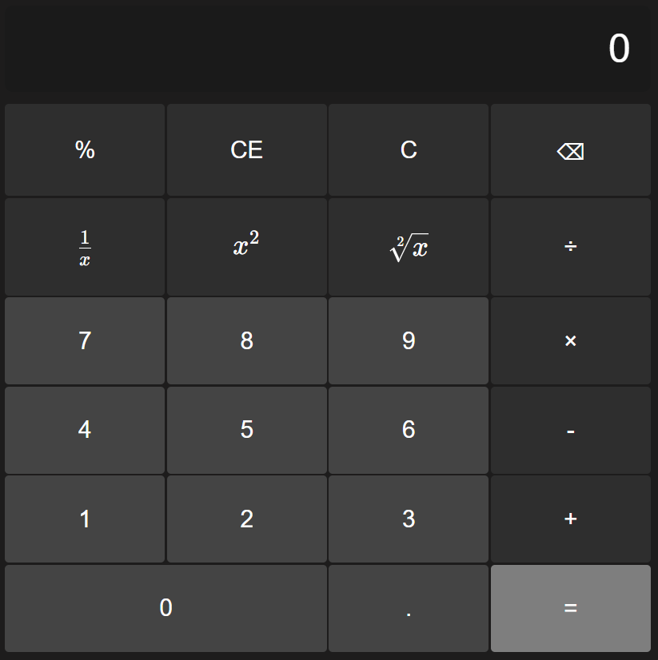

# Windows Calculator Alignment Fix

Addressing an issue with the Windows calculator where [some of the buttons are off by a single pixel](https://youtube.com/shorts/IHhpu_bfYZk?si=wgmeiUmS5S3lxKSa) between the buttons: 
$x^2$ $\sqrt[2]{x}$  
`8` `9`  
This is an attempt to resolve the issue by building a calculator using HTML, CSS, and JavaScript.

Here, we can see the alignment issue within the Windows 11 calculator:

Wheras here is my revision of the calculator fixing this issue.

_Note, this is a random project I decided to do at 6 in the morning after my OCD got the best of me_